<div align="center">

<!-- HERO BANNER — custom SVG -->
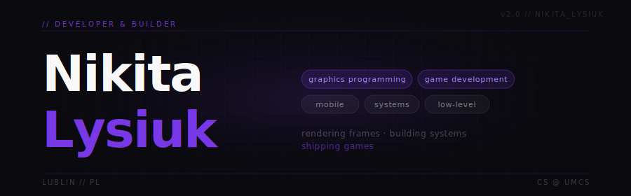

</div>

<!---------- TYPING HEADLINE ---------->
<div align="center">
<br/>

[](https://github.com/Nikita-Lysiuk)

<br/>

<!---------- SOCIAL BADGES ---------->
[](https://github.com/Nikita-Lysiuk)&nbsp;
[](https://linkedin.com/in/nikita-lysiuk-7682b42ab/)&nbsp;
[](https://x.com/Nikita_lysiuk06)&nbsp;
[](https://stackoverflow.com/users/23113955/nikita)

</div>

<br/>

<!---------- PHILOSOPHY ---------->
<div align="center">
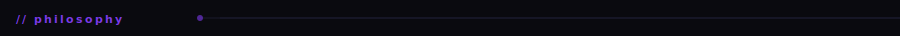
</div>

```
I write code that lives close to the metal.
Pipelines, shaders, physics — that's where I feel at home.

By day I ship production software.
By night I push polygons and simulate worlds.

The goal:      build something people play.
The long game: build the studio that makes it.
```

<br/>

<!---------- STACK ---------->
<div align="center">

</div>

<div align="center">
</div>

<br/>

<!---------- WHAT I CARE ABOUT ---------->
<div align="center">
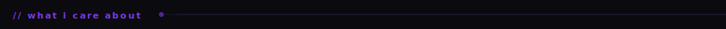
</div>

<br/>

<div align="center">

<table>
<tr>
<td align="center" width="33%">

**`rendering`**<br/>
<sub>making pixels look right<br/>shaders · pipelines · light</sub>

</td>
<td align="center" width="33%">

**`systems`**<br/>
<sub>making things run fast<br/>architecture · memory · perf</sub>

</td>
<td align="center" width="33%">

**`craft`**<br/>
<sub>making code worth reading<br/>the kind someone opens and nods</sub>

</td>
</tr>
</table>

</div>

<br/>

<!---------- STATUS ---------->
<div align="center">
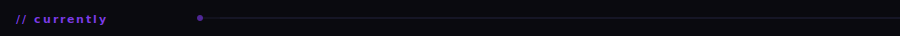
</div>

<br/>

<div align="center">

| | status | |
|:---:|:---|:---|
| 🔴 | **building** | [Fluid-Engine](https://github.com/Nikita-Lysiuk/Fluid-Engine) — fluid simulation in Rust + Vulkan, chasing CPU/GPU parallelism |
| 🟡 | **learning** | GPU compute, engine architecture — things that don't show up on job postings |
| 🟢 | **shipping** | production code that solves real problems |

</div>

<br/>

<!---------- SELECTED WORK ---------->
<div align="center">
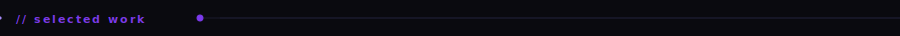
</div>

<br/>

<!-- Featured project — full width -->
<div align="center">

[](https://github.com/Nikita-Lysiuk/Fluid-Engine)

</div>

<!-- 2x2 grid -->
<div align="center">

[](https://github.com/Nikita-Lysiuk/Vinyl-Store)&nbsp;[](https://github.com/Nikita-Lysiuk/egypt_adventure)

[](https://github.com/Nikita-Lysiuk/PixelPatternsAI)&nbsp;[](https://github.com/Nikita-Lysiuk/spring-library)

</div>

<br/>

<!---------- STATS ---------->
<div align="center">
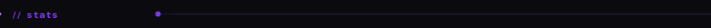
</div>

<br/>

<div align="center">

[](https://github.com/Nikita-Lysiuk)&nbsp;[](https://github.com/Nikita-Lysiuk)

[](https://github.com/Nikita-Lysiuk)

[](https://github.com/Nikita-Lysiuk)


</div>

<br/>

<!---------- RECENT ACTIVITY ---------->
<div align="center">
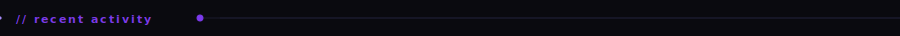
</div>

<br/>

<!--START_SECTION:activity-->
<!--END_SECTION:activity-->

<br/>

<!---------- FOOTER ---------->
<div align="center">


<br/><br/>

<sub><i>"the best rendering is invisible. the best game is unforgettable."</i></sub>

<br/><br/>


</div>
