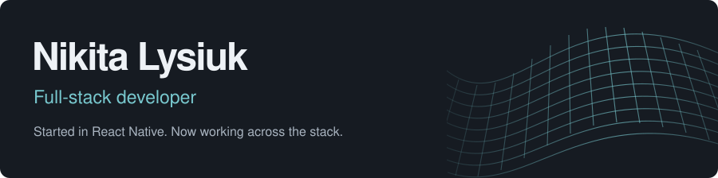
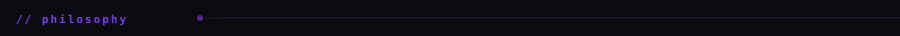
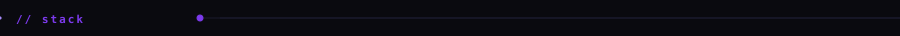
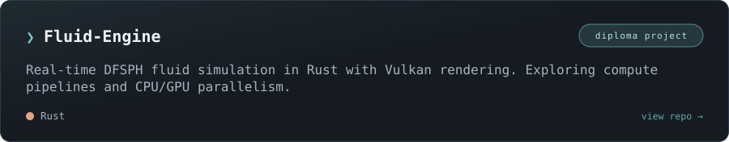
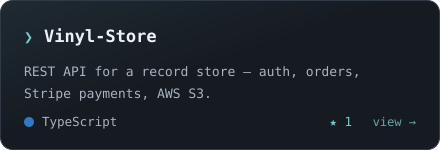
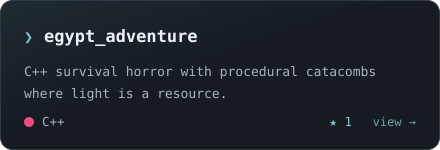
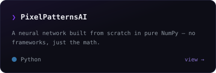
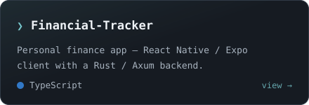
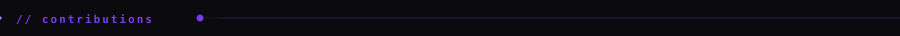

<!-- HERO BANNER — custom SVG -->


<!---------- TYPING HEADLINE ---------->

 

 

<!---------- SOCIAL BADGES ---------->
&nbsp;
&nbsp;
&nbsp;

 

<!---------- PHILOSOPHY ---------->





 

<!---------- STACK ---------->





 

what the repos say:

[](https://github.com/Nikita-Lysiuk?tab=repositories)

 

<!---------- WHAT I CARE ABOUT ---------->

 



 

<!---------- SELECTED WORK ---------->

 

<!-- Featured project — full width -->

[](https://github.com/Nikita-Lysiuk/Fluid-Engine)

<!-- 2x2 grid -->
<table width="100%">
<tr>
<td width="50%">

[](https://github.com/Nikita-Lysiuk/Vinyl-Store)

</td>
<td width="50%">

[](https://github.com/Nikita-Lysiuk/egypt_adventure)

</td>
</tr>
<tr>
<td width="50%">

[](https://github.com/Nikita-Lysiuk/PixelPatternsAI)

</td>
<td width="50%">

[](https://github.com/Nikita-Lysiuk/Financial-Tracker)

</td>
</tr>
</table>

 

<!---------- STATS ---------->

 

<table width="100%">
<tr>
<td width="50%" align="center">

[](https://github.com/Nikita-Lysiuk)

</td>
<td width="50%" align="center">

</td>
</tr>
</table>

 

<!---------- CONTRIBUTIONS ---------->



 

[](https://github.com/Nikita-Lysiuk?tab=overview)

 

<!---------- FOOTER ---------->

  

